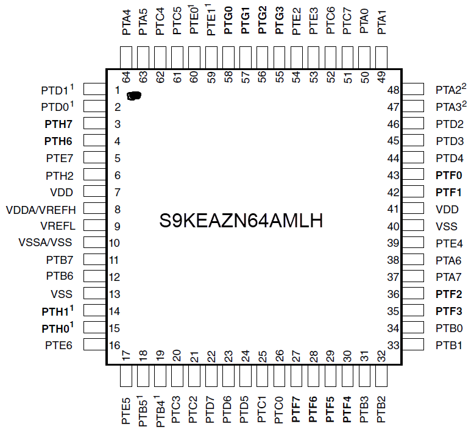
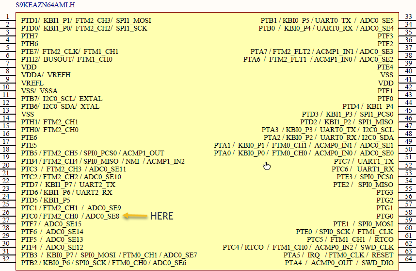
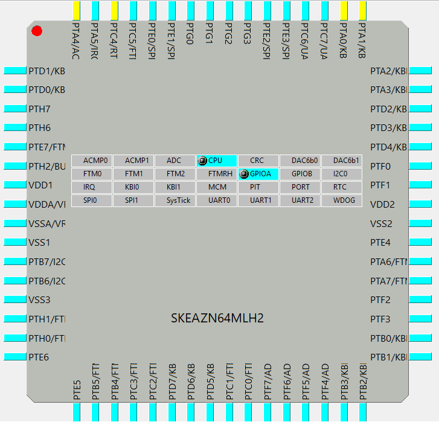

## NXP KEA64 - KBOOT custom bootloader

  1. Introduction: [intro.md](doc/intro.md)
  2. Target Projects: [target_projects.md](doc/target_projects.md)

## CPU Info

  * E Series Bootloader info: https://www.nxp.com/docs/en/application-note/AN5400.pdf
  * KEA Manuals: [https://www.nxp.com/products/...](https://www.nxp.com/products/processors-and-microcontrollers/arm-based-processors-and-mcus/kinetis-cortex-m-mcus/ea-series-automotive-m0-plus/ultra-reliable-kea-automotive-microcontrollers-mcus-based-on-arm-cortex-m0-plus-core:KEA?&tab=Documentation_Tab&linkline=Application-Note)

**Recommended IDEs**: The bootloader was default build using IAR / KEIL / [KDS](https://www.nxp.com/products/wireless-connectivity/proprietary-ieee-802.15.4-based/kinetis-design-studio-integrated-development-environment-ide:KDS_IDE)

## Pre-requirements:

  * Python needs to be installed and available in console/cmd;

## Bootloader

  * Refference: https://www.nxp.com/docs/en/reference-manual/KBTLDR200RM.pdf
  * Documentation: https://www.nxp.com/pip/MCUBOOT?tab=Documentation_Tab

## MCU

  * MCU Specs: http://www.hotenda.com/product-item/embedded-microcontrollers/S9KEAZN64AMLH/H2333808.html
  * S9KEAZN64AMLH: https://www.nxp.com/docs/en/application-note/AN4942.pdf

## ARM Compiler:

  * http://infocenter.arm.com/help/index.jsp?topic=/com.arm.doc.dui0491f/CHDDIJFH.html  

## Debugging:
  * https://community.nxp.com/docs/DOC-101845
  
## To read:
  * Simple Serial Bootloader: https://community.nxp.com/docs/DOC-335384
  * How to support multiple targets in CodeWarrior(Classic, Eclipse)/KDS: https://community.nxp.com/docs/DOC-332027

To be continued...
